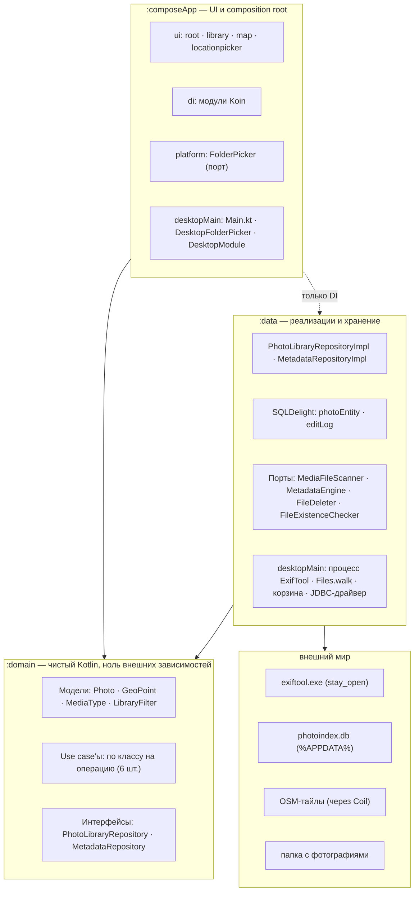
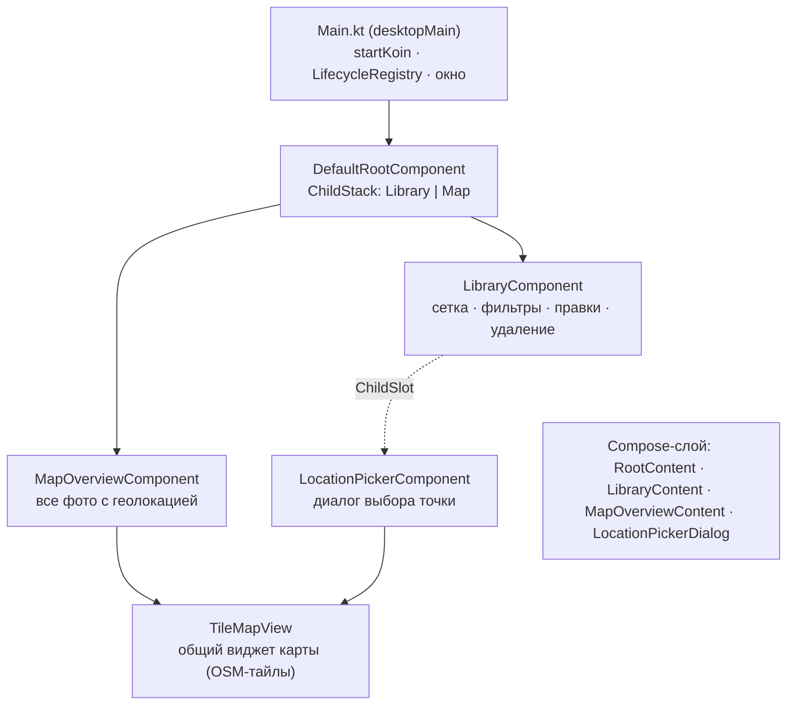
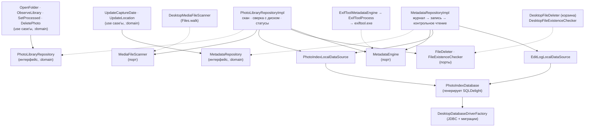

# Диаграммы архитектуры

Три уровня детализации: модули → UI-компоненты → классы и связи.
Актуально на фазу 4 (просмотр, статусы, редактирование метаданных, карта, удаление).

## 1. Модули

Обе стрелки зависимостей смотрят на `:domain` — он не знает никого.
Пунктирная связь `:composeApp → :data` существует только ради DI: composition root
должен видеть реализации, чтобы связать их с интерфейсами через Koin.

## 2. Дерево UI-компонентов (Decompose)

Логика экранов живёт в компонентах — обычных Kotlin-классах, тестируемых без UI.
Compose-функции только рисуют `State` и шлют события обратно.
`LocationPicker` создаётся по требованию (слот пуст, пока не нажали «Выбрать на карте»)
и умирает при закрытии диалога.

## 3. Классы и интерфейсы domain/data

Сплошная стрелка — «вызывает», пунктирная — «реализует» (конкретный класс подставляет Koin).

### Пример пути одного действия — «пользователь сохранил дату»

1. `LibraryComponent.onSaveCaptureDate` парсит ввод →
2. `UpdateCaptureDateUseCase` →
3. интерфейс `MetadataRepository` → (Koin подставил) `MetadataRepositoryImpl`:
   старое значение в `editLog` → `MetadataEngine.writeMetadata` →
   (Koin подставил) `ExifToolMetadataEngine` → `ExifToolProcess` → `exiftool.exe` →
   контрольное чтение → `PhotoIndexLocalDataSource.updateTakenAt` →
4. SQLite эмитит новый `Flow` → сетка и панель перерисовываются сами.

### Особые случаи

- `FolderPicker` — единственный порт вне `:data` (живёт в `:composeApp/platform`),
  потому что выбор папки — UI-взаимодействие, а не работа с данными.
- Библиотечный `Flow` самовосстанавливается: каждая выдача сверяется с диском,
  пропавшие файлы скрываются и удаляются из индекса.
